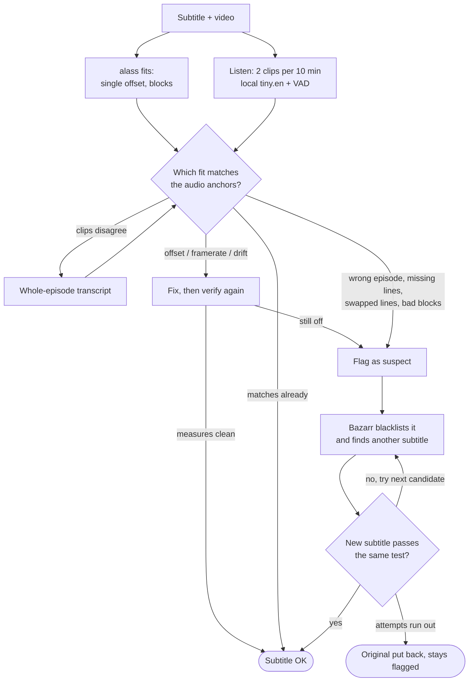

# Verifyarr

[](https://github.com/KlausHammer/Verifyarr/actions/workflows/tests.yml)

**Self-hosted subtitle checker and fixer for a media library managed by Bazarr.** Bazarr downloads subtitles; many
of them are out of sync, cut for another release, missing lines or simply for the wrong episode.
Verifyarr *listens* to the audio with a small local Whisper model, compares what is said with what the
subtitle says at the same moment, **fixes what can be fixed safely**, and **flags the rest** so Bazarr can
fetch a new one. No cloud speech recognition, no API key, runs on a small CPU box.

| Problem in the subtitle | What Verifyarr does |
|---|---|
| Constant offset, framerate (23.976 ↔ 24), PAL (24 ↔ 25), steady drift | **Fixes it** (original backed up) |
| Blocks at different offsets (cut versions, ads) | Re-times from audio anchors when the evidence is dense, else flags |
| Missing stretch (middle, start, end) | Flags it. Songs and lyrics are not counted as missing speech |
| Wrong episode or release | Flags it, never rewrites it |
| Swapped line pairs, per-line noise | Flags it |
| Suspect file | Optional: quarantine, tell Bazarr to blacklist, or fetch a replacement |

## How it works



alass proposes timings; the audio decides. The refetch loop (blacklist, find another, test it) runs when the action
is set to `remediate`; with `off` or `quarantine` the file is only flagged or moved. A fix is only written when the corrected file measures clean
against the same Whisper evidence, so a bad fit (alass is sometimes wildly wrong) is rejected instead of applied.

## Install with Docker

Grab the compose file (it builds straight from this repo, no separate clone needed),
then edit it before starting:

```bash
curl -O https://raw.githubusercontent.com/KlausHammer/Verifyarr/main/docker-compose.yml
docker compose up -d
```

- `volumes:` — point `/media/movies` and `/media/tv` at your real media folders, using the
  same paths Sonarr/Radarr see them under, so paths handed over from Bazarr exist here too.
- `PUID`/`PGID` — your ids on the host (`id -u` / `id -g`), so files Verifyarr writes aren't
  root-owned.
- `TZ` — your timezone (scheduled scans run on the server's local time).
- `./data` — keep it on a local disk: the SQLite database locks up on NFS/SMB shares.
- Whisper models of your own (optional): uncomment the `/models:ro` mount and set Settings →
  Correctness → "Model file path" to `/models/ggml-<name>.bin`.

Open `http://your-server:6868`, create an admin password, then go through Settings: General
(Root Folders), Correctness (local Whisper works out of the box, no key needed), Bazarr (URL + API key),
Automation, Scheduling.

Forgot the admin password? `docker exec -it verifyarr python3 verifyarr.py reset-password`.

### Host notes (Debian, Ubuntu, Mint, Fedora, NAS boxes)

The image is Debian-based, so the host's distribution mostly matters for Docker itself and file permissions.
Only the Debian/Ubuntu-style host (WSL2) has been run so far; the rest below follows from how the container works.

- **SELinux (Fedora, RHEL, Rocky, Alma, openSUSE):** bind mounts need a label or reads fail with "permission denied":
  add `:z` to the volumes (`./data:/data:z`, `/path/to/media/tv:/media/tv:z`).
- **Rootless Docker or Podman:** `PUID`/`PGID` map into your user namespace, so use `0` or leave them for a rootless setup. If the
  container cannot `chown /data` it carries on and warns; `./data` must then already be writable.
- **GPU (optional):** the `render` group id differs per distro (check `getent group render`). With no `/dev/dri` it runs on the CPU, which is what the tests used. NVIDIA-only hosts also run on the CPU.
- **CPU:** Whisper uses every core by default. Limit threads or pick cores under Settings → Correctness (e.g. `0-3`).
  In a Proxmox/VM guest set the CPU type to `host`, otherwise AVX/AVX2 is hidden and Whisper is several times slower.
- **Building:** the first `docker compose up` compiles alass (Rust) and whisper.cpp (C++), which takes a while and wants a few GB of free RAM. Small
  ARM boards (Raspberry Pi 4/5, 64-bit OS) should work but are untested. Build on the machine that will run it: whisper.cpp is
  compiled for that CPU, so an image built elsewhere can stop with "illegal instruction".
- **Unraid, Synology, TrueNAS:** use the `PUID`/`PGID` of the user that owns your media (Unraid usually 99/100). Keep `/data` on a local disk.


## Connecting it to Bazarr

Enter Bazarr's URL and API key under Settings → Bazarr. That is all that is needed. Verifyarr then
polls Bazarr's "wanted" lists (every 3 minutes by default) and runs a scheduled sweep (Settings → Scheduling),
checks new downloads, and uses Bazarr's API to blacklist a bad subtitle and fetch another.


## Action on a suspect file

Set per-check (correctness / line-order) under Settings → Automation:

| Value | Does |
|---|---|
| `off` *(default)* | Flags it in the report, nothing else |
| `quarantine` | Moves it to `/data/quarantine` |
| `blacklist` | Tells Bazarr to blacklist that source, which removes the file and makes Bazarr search for a replacement on its own |
| `remediate` | Same as `blacklist`, then waits for and tests whatever Bazarr finds itself; if that fails, tries more candidates from Bazarr's provider search until one passes or attempts run out. If none passes, the original is put back and stays flagged |

`blacklist`/`remediate` hand the file to Bazarr rather than quarantining it locally, since Bazarr
only auto-searches for a replacement once it's actually deleted the file. Nothing is lost even
so: if "Back up subtitles" is on (Settings → General), a copy is saved to `/data/backups` first.
If Bazarr can't be reached or has no record of the file, it falls back to a local quarantine
move instead.


## Notes

- App settings live in the webapp; `docker-compose.yml` holds container identity
  (`PUID`/`PGID`/`UMASK`/`TZ`/`PORT`) plus `WHISPER_MODEL`.
- The correctness check skips audio in a language Whisper isn't reliable for by default
  (configurable); a subtitle in a different language than the audio is machine-translated before
  comparing, so language alone never causes a false flag.
- Only one job (sweep/single) runs at a time; cancelling one stops it between files, not mid
  API call.
- Movies are supported for sync/correctness; `blacklist`/`remediate` are series-only for now.


## To do

- **Generate a subtitle when none exists.** Transcribe the audio with a cloud Whisper (Groq / OpenRouter /
  Cloudflare) and, when the wanted language is not the spoken one, translate the already-timed lines with an
  LLM. Not part of the released feature set yet.


## Why `tiny.en`


<details><summary>Data behind the chart</summary>

<!-- table:models -->
| Model | Errors handled, sampled | Errors handled, full | Healthy files left alone, sampled / full | Speed (x real time) | RAM | Word F1 |
|---|---|---|---|---|---|---|
| **tiny.en (greedy) — default** | 98.0 % (499/509) | 99.0 % (504/509) | 10/10 and 10/10 | 25.5 | 0.6 GB | 0.79 |
| tiny.en | 96.9 % (493/509) | 98.8 % (503/509) | 10/10 and 9/10 | 16.8 | 0.6 GB | 0.80 |
| tiny.en q5_1 | 97.4 % (496/509) | 96.9 % (493/509) | 9/10 and 9/10 | 16.5 | 0.6 GB | 0.80 |
| base.en (greedy) | 96.1 % (489/509) | 97.8 % (498/509) | 9/10 and 8/10 | 16.4 | 0.7 GB | 0.84 |
| base.en | 96.5 % (491/509) | 97.1 % (494/509) | 9/10 and 7/10 | 11.7 | 0.8 GB | 0.84 |
| base.en q5_1 | 97.1 % (494/509) | 97.8 % (498/509) | 9/10 and 9/10 | 11.0 | 0.7 GB | 0.84 |
| small.en (greedy) | 97.1 % (494/509) | 98.6 % (502/509) | 9/10 and 5/10 | 5.8 | 1.2 GB | 0.89 |
| small.en | 97.8 % (498/509) | 99.0 % (504/509) | 9/10 and 5/10 | 4.5 | 1.3 GB | 0.88 |
| small.en q5_1 | 97.1 % (494/509) | 98.2 % (500/509) | 8/10 and 5/10 | 4.6 | 1.1 GB | 0.89 |
| medium.en (greedy) | 97.4 % (496/509) | 98.4 % (501/509) | 10/10 and 8/10 | 2.1 | 2.4 GB | 0.91 |
| medium.en | 97.4 % (496/509) | 98.6 % (502/509) | 8/10 and 6/10 | 1.8 | 2.7 GB | 0.90 |
| medium.en q5_0 | 97.1 % (494/509) | 98.4 % (501/509) | 9/10 and 6/10 | 1.6 | 1.8 GB | 0.90 |
| large-v3-turbo q8_0 | 97.2 % (495/509) | 99.6 % (507/509) | 10/10 and 9/10 | 1.7 | 1.8 GB | 0.88 |
| large-v3-turbo q5_0 | 97.1 % (494/509) | 98.8 % (503/509) | 9/10 and 6/10 | 1.3 | 1.5 GB | 0.89 |
| cloud: Groq large-v3-turbo | 98.0 % (499/509) | 99.2 % (505/509) | 9/10 and 9/10 | network | - | 0.89 |
<!-- /table:models -->

</details>

All numbers come from the ten verified episodes in [`tests/known_good/`](tests/known_good/README.md): every model gets the
same injected errors (10 episodes x 58 scenarios x 15 setups x 2 modes = 17,400 runs). The models differ in what they cost
and in false alarms, not in what they catch. `tiny.en` (greedy) is the default because:

- **It leaves healthy files alone.** All ten verified, untouched episodes come out unflagged in both modes. In full-transcript mode
  `small.en` flags half of them, `medium.en` and `large-v3-turbo q5_0` four of ten; the block detector is calibrated on `tiny.en` output.
- **The same result, 5-20x faster.** A 58-minute episode takes about **2 min** (tiny), 10-13 min (small) or 28-45 min (medium / large-v3-turbo) on 4 CPU threads.
- **0.6 GB RAM** instead of 1.2-2.7 GB, so it fits an Intel N100.
- **What it gives up is word accuracy** (F1 0.79 against 0.88-0.91), which the timing checks do not use: offsets are fixed in 49-50 of 50 runs by every model, rate errors in 149-159 of 160, wrong episodes and swapped lines are caught by all.
- **Cloud Whisper (Groq) is not better** (98.0 % handled, one false alarm per mode) and adds a key, a network dependency and rate limits, so the checks never use it.

Charts, tables and the caveats: [models and tests](docs/models_and_tests.md).

## How well it works


<details><summary>Data behind the chart</summary>

<!-- table:errors -->
| Error type | Passes when | Sampled | Full transcript | Range over all 15 models (sampled) |
|---|---|---|---|---|
| Constant offset (0.7 s to 45 s) | fixed (median error <= 0.25 s, 98 % of lines within 1 s) | 50/50 | 50/50 | 49-50 of 50 |
| Framerate, PAL, drift | fixed, same bar | 159/160 | 159/160 | 152-159 of 160 |
| Blocks at different offsets | flagged (repair is a bonus) | 194/200 | 199/200 | 190-197 of 200 |
| Missing stretch (>= 20 dialogue lines) | flagged and left untouched | 36/39 | 36/39 | 33-38 of 39 |
| Wrong episode | flagged SUSPECT, left untouched | 10/10 | 10/10 | 10 of 10 |
| Swapped lines | flagged for review | 20/20 | 20/20 | 20 of 20 |
| Drift + swapped lines | timing fixed and swaps flagged | 10/10 | 10/10 | 9-10 of 10 |
| Dropped / duplicated cues | left untouched | 10/10 | 10/10 | 10 of 10 |
| Per-line jitter (nothing to fix) | no worse than injected | 10/10 | 10/10 | 10 of 10 |
| Healthy file (no false alarm) | left untouched, not flagged | 10/10 | 10/10 | 8-10 of 10 |
<!-- /table:errors -->

</details>

| Test | What was run | Result |
|---|---|---|
| Injected-error matrix | 10 verified episodes x 58 error scenarios x 15 model setups x sampled/full = **17,400 runs** | no pipeline errors. The default model fixes every constant offset and 159 of 160 rate errors, flags 194 of 200 block errors in sampled mode (199 in full) and every wrong episode and swap |
| Healthy files | the same ten episodes with no error | 10 of 10 left untouched and not flagged in both modes |
| Missing stretches | holes and cut-offs of different size | found once about 20 dialogue lines are gone (82-95 %); smaller holes and cuts inside the first and last two minutes are not judged |

Anyone can rerun this without any media: the data, the stored Whisper output and the recorded alass answers are in the repo
([how](tests/known_good/README.md)).

### Known limits

- A hole that removes fewer than about 20 dialogue lines is usually not seen (about 1 in 5 for fewer than 10 lines, 36 % for 10-19), and the first and last two minutes are not judged on purpose.
- Sampled mode can miss a short block error that falls between its clips (6 of 200); the full transcript finds almost all.
- Whisper evidence is thin where there is no dialogue (credits): an error confined there cannot be judged reliably.
- A file that alass splits into several blocks is always reported as "fetch a fresh subtitle", even after a verified repair.
- Verified on ten English episodes with injected errors, which model real errors but are not a sample of them. Lines swapped inside a cue are not verified in the reference set (22 lines are flagged across the ten files).
- A rate fit can read a staircase of cuts as a rate. A rate rewrite on a file judged the wrong subtitle is now undone and the original kept (flagged SUSPECT): this was 17 of the 17,400 runs, all one Bob's Burgers case, where a -4.1 % stretch had left the file further from the truth (error 54 s to 110 s).
- With a fixed hash seed the matrix is repeatable; without it 0.1 % of the verdicts differ between runs, so the pipeline has a small order dependence.
