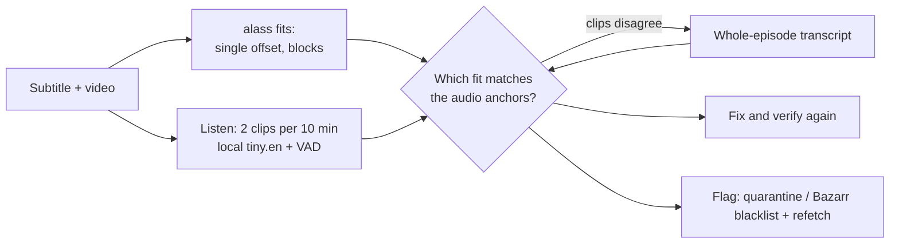

# Verifyarr

[](https://github.com/KlausHammer/Verifyarr/actions/workflows/tests.yml)

**Self-hosted subtitle checker and fixer for a Plex/Bazarr library.** Bazarr downloads subtitles; many
of them are out of sync, cut for another release, missing lines or simply for the wrong episode.
Verifyarr *listens* to the audio with a small local Whisper model, compares what is said with what the
subtitle says at the same moment, **fixes what can be fixed safely**, and **flags the rest** so Bazarr can
fetch a new one. No cloud speech recognition, no API key, runs on a small CPU box.

| Problem in the subtitle | What Verifyarr does |
|---|---|
| Constant offset, framerate (23.976 ↔ 24), PAL (24 ↔ 25), steady drift | **Fixes it** (original backed up) |
| Blocks at different offsets (cut versions, ads) | Re-times from audio anchors when the evidence is dense, else flags |
| Missing stretch (middle, start, end) | Flags it. Songs and lyrics are not counted as missing speech |
| Wrong episode or release | Flags it, never rewrites it |
| Swapped line pairs, per-line noise | Flags it |
| Suspect file | Optional: quarantine, tell Bazarr to blacklist, or fetch a replacement |

## How it works



alass proposes timings; the audio decides. A fix is only written when the corrected file measures clean
against the same Whisper evidence, so a bad fit (alass is sometimes wildly wrong) is rejected instead of applied.

## Install with Docker

Grab the compose file (it builds straight from this repo, no separate clone needed),
then edit it before starting:

```bash
curl -O https://raw.githubusercontent.com/KlausHammer/Verifyarr/main/docker-compose.yml
docker compose up -d
```

- `volumes:` — point `/media/movies` and `/media/tv` at your real media folders, using the
  same paths Sonarr/Radarr see them under, so paths handed over from Bazarr exist here too.
- `PUID`/`PGID` — your ids on the host (`id -u` / `id -g`), so files Verifyarr writes aren't
  root-owned.
- `TZ` — your timezone (scheduled scans run on the server's local time).
- `./data` — keep it on a local disk: the SQLite database locks up on NFS/SMB shares.
- Whisper models of your own (optional): uncomment the `/models:ro` mount and set Settings →
  Correctness → "Model file path" to `/models/ggml-<name>.bin`.

Open `http://your-server:6868`, create an admin password, then go through Settings: General
(Root Folders), Correctness (local Whisper works out of the box, no key needed), Bazarr (URL + API key),
Automation, Scheduling.

Forgot the admin password? `docker exec -it verifyarr python3 verifyarr.py reset-password`.


## Connecting it to Bazarr

Enter Bazarr's URL and API key under Settings → Bazarr. That is all that is needed. Verifyarr then
polls Bazarr's "wanted" lists (every 3 minutes by default) and runs a scheduled sweep (Settings → Scheduling),
checks new downloads, and uses Bazarr's API to blacklist a bad subtitle and fetch another.


## Action on a suspect file

Set per-check (correctness / line-order) under Settings → Automation:

| Value | Does |
|---|---|
| `off` *(default)* | Flags it in the report, nothing else |
| `quarantine` | Moves it to `/data/quarantine` |
| `blacklist` | Tells Bazarr to blacklist that source, which removes the file and makes Bazarr search for a replacement on its own |
| `remediate` | Same as `blacklist`, then waits for and tests whatever Bazarr finds itself; if that fails, tries more candidates from Bazarr's provider search until one passes or attempts run out. If none passes, the original is put back and stays flagged |

`blacklist`/`remediate` hand the file to Bazarr rather than quarantining it locally, since Bazarr
only auto-searches for a replacement once it's actually deleted the file. Nothing is lost even
so: if "Back up subtitles" is on (Settings → General), a copy is saved to `/data/backups` first.
If Bazarr can't be reached or has no record of the file, it falls back to a local quarantine
move instead.


## Notes

- App settings live in the webapp; `docker-compose.yml` holds container identity
  (`PUID`/`PGID`/`UMASK`/`TZ`/`PORT`) plus `WHISPER_MODEL`.
- The correctness check skips audio in a language Whisper isn't reliable for by default
  (configurable); a subtitle in a different language than the audio is machine-translated before
  comparing, so language alone never causes a false flag.
- Only one job (sweep/single) runs at a time; cancelling one stops it between files, not mid
  API call.
- Movies are supported for sync/correctness; `blacklist`/`remediate` are series-only for now.


## To do

- **Generate a subtitle when none exists.** Transcribe the audio with a cloud Whisper (Groq / OpenRouter /
  Cloudflare) and, when the wanted language is not the spoken one, translate the already-timed lines with an
  LLM. Not part of the released feature set yet.


## Why `tiny.en`


<details><summary>Data behind the chart</summary>

| Model | Passed of 242 | Speed (× real time, 4 CPU threads) | Word F1 |
|---|---|---|---|
| **tiny.en (greedy), default** | 239 | 25 | 0.78 |
| tiny.en | 236 | 17 | 0.79 |
| base.en (greedy) | 239 | 16 | 0.83 |
| small.en (greedy) | 240 | 5.8 | 0.88 |
| small.en | 237 | 4.5 | 0.88 |
| medium.en (greedy) | 237 | 2.1 | 0.90 |
| medium.en | 237 | 1.8 | 0.89 |
| large-v3-turbo q8_0 | 238 | 1.7 | 0.89 |
| large-v3-turbo q5_0 | 238 | 1.3 | 0.89 |
| cloud: Groq large-v3-turbo | 232 | network | 0.89 |

</details>

Every model catches and fixes the same errors; they differ in what they cost. `tiny.en` is the default because:

- **Same result, 5–20× faster.** A 58-minute episode takes about **2 min** (tiny), 12 min (small) or 30–45 min (medium / large-v3-turbo), on 4 CPU threads.
- **0.6 GB RAM** instead of 1.2–2.7 GB, so it fits an Intel N100.
- **What it gives up is word accuracy** (F1 0.78 vs 0.88–0.90). The checks compare anchors and timing, which the larger models do not improve: the pass rate is 236–240 of 242 for every local model, with no ranking.
- **Cloud Whisper (Groq) is not better** (232 of 242) and adds a key, a network dependency and rate limits, so the checks never use it.

All thresholds are calibrated on `tiny.en`; other models transcribe differently. Details: [`docs/modelvalg_godkendte.md`](docs/modelvalg_godkendte.md).

## How well it works


<details><summary>Data behind the chart</summary>

| Error type | Passed / run | Note |
|---|---|---|
| Constant offset (fixed) | 63 / 66 | 3 misses: +0.3 s, just over the 0.25 s bar |
| Framerate, PAL, drift (fixed) | 66 / 66 | |
| Mistimed blocks (detected) | 44 / 44 | |
| Missing middle (detected) | 11 / 11 | |
| Wrong episode (detected) | 11 / 11 | |
| Swapped lines (detected) | 11 / 11 | |
| Drift + swapped lines (detected) | 11 / 11 | |
| Healthy file, no false alarm | 11 / 11 | |
| Dropped / duplicated cues | 11 / 11 | |
| Per-line jitter (nothing to fix) | 8 / 11 | alass chases the noise (all models) |

</details>

| Test | What was run | Result |
|---|---|---|
| Injected-error matrix | 11 approved episodes (6 *Slow Horses* + 5 other series) × 23 error scenarios × 15 model setups × sampled/full = **7,590 runs** | 0 errors. Production setup: 239 of 242. Every miss is a +0.3 s shift (just above the 0.25 s decision bar) or per-line jitter (nothing to fix) |
| Healthy files | the same 11 episodes with no error | 11 of 11 left untouched, no false alarms |
| Real library, read-only | 20 random episodes, two rounds, library mounted read-only, dry run | found and fixed two real bugs (wrong audio track on multi-language files, a song counted as missing lines); the rest ok or correctly flagged |
| Real flawed episodes | 5 episodes with known problems, judged by a *different* Whisper model (small.en), see below | 4 fixed or correctly left alone, 1 wrong subtitle flagged |

**alass cannot tell on its own whether a subtitle is right.** On four real episodes it fixed none of the problems and caused one: it left Community S03E20 at 62 % of lines more than 2 s off (it sees nothing), made Brooklyn Nine-Nine S01E02 worse (62 % → 90 %), broke the already-correct S.W.A.T. S02E12 (6 % → 60 %), and did nothing for Taskmaster S06E02 (98 % → 98 %). With Verifyarr the same episodes end at 6 %, 8 %, 4 % and 6 %, the correct file untouched, and a fifth episode with a wrong subtitle (My Name Is Earl S03E13) flagged and left alone.

### Known limits

- Whisper evidence is thin where there is no dialogue (credits, the last minute): an error confined there cannot be judged reliably.
- Block detection depends on dialogue density; thin-dialogue episodes give fewer anchors.
- A file that alass splits into several blocks is always reported as "fetch a fresh subtitle", even after a verified repair.
- Tested on English audio, 11 approved episodes for the matrix and 25 real episodes; injected errors are a model of real ones, not a sample.
