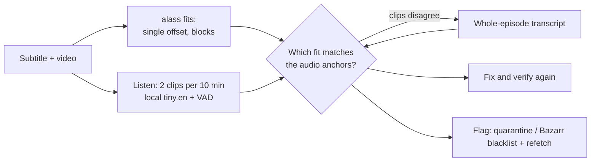
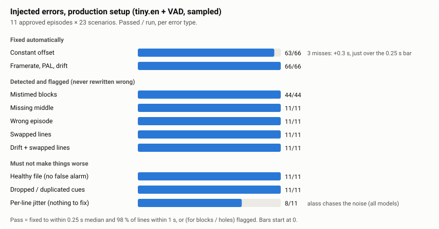

# Verifyarr

[](https://github.com/KlausHammer/Verifyarr/actions/workflows/tests.yml)

**Self-hosted subtitle checker and fixer for a Plex/Bazarr library.** Bazarr downloads subtitles; many
of them are out of sync, cut for another release, missing lines or simply for the wrong episode.
Verifyarr *listens* to the audio with a small local Whisper model, compares what is said with what the
subtitle says at the same moment, **fixes what can be fixed safely**, and **flags the rest** so Bazarr can
fetch a new one. No cloud speech recognition, no API key, runs on a small CPU box.

| Problem in the subtitle | What Verifyarr does |
|---|---|
| Constant offset, framerate (23.976 ↔ 24), PAL (24 ↔ 25), steady drift | **Fixes it** (original backed up) |
| Blocks at different offsets (cut versions, ads) | Re-times from audio anchors when the evidence is dense, else flags |
| Missing stretch (middle, start, end) | Flags it. Songs and lyrics are not counted as missing speech |
| Wrong episode or release | Flags it, never rewrites it |
| Swapped line pairs, per-line noise | Flags it |
| Suspect file | Optional: quarantine, tell Bazarr to blacklist, or fetch a replacement |
| No subtitle at all | Optional: generate one with a cloud Whisper (Groq / OpenRouter / Cloudflare) |

## How it works



alass proposes timings; the audio decides. A fix is only written when the corrected file measures clean
against the same Whisper evidence, so a bad fit (alass is sometimes wildly wrong) is rejected instead of applied.

## Why `tiny.en`


Every model catches and fixes the same errors; they differ in what they cost. `tiny.en` is the default because:

- **Same result, 5–20× faster.** A 58-minute episode takes about **2 min** (tiny), 12 min (small) or 30–45 min (medium / large-v3-turbo), on 4 CPU threads.
- **0.6 GB RAM** instead of 1.2–2.7 GB, so it fits an Intel N100.
- **What it gives up is word accuracy** (F1 0.78 vs 0.88–0.90). The checks compare anchors and timing, which the larger models do not improve: the pass rate is 236–240 of 242 for every local model, with no ranking.
- **Cloud Whisper (Groq) is not better** (232 of 242) and adds a key, a network dependency and rate limits, so checks never use it. Cloud is for *generating* subtitles only.

All thresholds are calibrated on `tiny.en`; other models transcribe differently. Details: [`docs/modelvalg_godkendte.md`](docs/modelvalg_godkendte.md).

## How well it works



| Test | What was run | Result |
|---|---|---|
| Unit and integration tests | `pytest`, 463 tests, run by GitHub Actions on every push and pull request (badge above): backend tests, frontend type check + build, Docker image build | all pass: 393 run on GitHub, 70 run the real pipeline on real episodes. Their media and subtitles are copyrighted, so they are not in the repo: they skip on GitHub and run against your own data via `VERIFYARR_TEST_DATA` (see [tests/README.md](tests/README.md)) |
| Injected-error matrix | 11 approved episodes (6 *Slow Horses* + 5 other series) × 23 error scenarios × 15 model setups × sampled/full = **7,590 runs** | 0 errors. Production setup: 239 of 242. Every miss is a +0.3 s shift (just above the 0.25 s decision bar) or per-line jitter (nothing to fix) |
| Healthy files | the same 11 episodes with no error | 11 of 11 left untouched, no false alarms |
| Real library, read-only | 20 random episodes, two rounds, library mounted read-only, dry run | found and fixed two real bugs (wrong audio track on multi-language files, a song counted as missing lines); the rest ok or correctly flagged |
| Real flawed episodes | 5 episodes with known problems, judged by a *different* Whisper model (small.en), table below | 4 fixed or correctly left alone, 1 wrong subtitle flagged |
| Docker | clean build, health check, `PUID`/`PGID`, timezone, file ownership | pass |
| Frontend ↔ backend | every API call, settings field, database column and reason code compared | consistent |

**Five real flawed episodes: share of lines more than 2 s from the audio**

| Episode | Problem | Before | alass alone | Verifyarr |
|---|---|---|---|---|
| Community S03E20 | two blocks, −25.7 s and −19.4 s | 62 % | 62 % (sees nothing) | **6 %** |
| Brooklyn Nine-Nine S01E02 | drift +0.28 % | 62 % | 90 % (writes −16 s) | **8 %** |
| S.W.A.T. S02E12 | already in sync | 6 % | 60 % (splits into 6 blocks, up to 209 s) | **4 %** (not damaged) |
| Taskmaster S06E02 | constant −4.0 s | 98 % | 98 % (writes +30 to +54 s) | **6 %** |
| My Name Is Earl S03E13 | wrong subtitle | – | – | flagged, left untouched |

Taskmaster is also the worst failure found: a rate "rescue" built on alass' own clamped output once moved
the first line from 7 s to 82 s. It is fixed and is now a regression test (`tests/test_real_cases.py`).

### Known limits

- Whisper evidence is thin where there is no dialogue (credits, the last minute): an error confined there cannot be judged reliably.
- Block detection depends on dialogue density; thin-dialogue episodes give fewer anchors.
- A file that alass splits into several blocks is always reported as "fetch a fresh subtitle", even after a verified repair.
- Tested on English audio, 11 approved episodes for the matrix and 25 real episodes; injected errors are a model of real ones, not a sample.
- Chart data and script: [`docs/make_charts.py`](docs/make_charts.py).


## Install with Docker

Grab the compose file (it builds straight from this repo, no separate clone needed),
then edit it before starting:

```bash
curl -O https://raw.githubusercontent.com/KlausHammer/Verifyarr/main/docker-compose.yml
docker compose up -d
```

- `volumes:` — point `/media/movies` and `/media/tv` at your real media folders, using the
  same paths Sonarr/Radarr see them under, so paths handed over from Bazarr exist here too.
- `PUID`/`PGID` — your ids on the host (`id -u` / `id -g`), so files Verifyarr writes aren't
  root-owned.
- `TZ` — your timezone (scheduled scans run on the server's local time).
- `./data` — keep it on a local disk: the SQLite database locks up on NFS/SMB shares.
- Whisper models of your own (optional): uncomment the `/models:ro` mount and set Settings →
  Correctness → "Model file path" to `/models/ggml-<name>.bin`.

Open `http://your-server:8787`, create an admin password, then go through Settings: General
(Root Folders), Correctness (local Whisper works out of the box, no key needed), Bazarr (URL + API key),
Automation, Scheduling. Generate (see below) is optional and off by default.

Forgot the admin password? `docker exec -it verifyarr python3 verifyarr.py reset-password`.


## Connecting it to Bazarr

Settings → General → Post-processing → **Use post processing**, command for series:

```
docker exec verifyarr python3 verifyarr.py single \
  --video "{{episode}}" --subtitle "{{subtitles}}" --lang "{{subtitles_language_code2}}" \
  --provider "{{provider}}" --subs-id "{{subtitle_id}}" \
  --series-id "{{series_id}}" --episode-id "{{episode_id}}"
```

(For movies, swap in Bazarr's movie placeholders — `{{movie}}`, `{{radarr_id}}`, etc. — check
Bazarr's own placeholder list.) Needs the Bazarr container to be able to `docker exec` into this
one. If that's not set up, the periodic sweep (Settings → Scheduling) catches new downloads too,
just on a delay.


## Action on a suspect file

Set per-check (correctness / line-order) under Settings → Automation:

| Value | Does |
|---|---|
| `off` *(default)* | Flags it in the report, nothing else |
| `quarantine` | Moves it to `/data/quarantine` |
| `blacklist` | Tells Bazarr to blacklist that source, which removes the file and makes Bazarr search for a replacement on its own |
| `remediate` | Same as `blacklist`, then waits for and tests whatever Bazarr finds itself; if that fails, tries more candidates from Bazarr's provider search until one passes or attempts run out. If none passes, the original is put back and stays flagged |

`blacklist`/`remediate` hand the file to Bazarr rather than quarantining it locally, since Bazarr
only auto-searches for a replacement once it's actually deleted the file. Nothing is lost even
so: if "Back up subtitles" is on (Settings → General), a copy is saved to `/data/backups` first.
If Bazarr can't be reached or has no record of the file, it falls back to a local quarantine
move instead.


## Generating missing subtitles

Off by default (Settings → Generate → turn it on, plus its own switch under Automation → What
runs). For a video with no subtitle at all in a wanted language:

1. The whole audio track is transcribed with Whisper, in chunks, with real timestamps — not the
   short sampled clips the correctness check uses. Chunks are cut in silences rather than at
   fixed offsets, long silences aren't uploaded at all, and segments Whisper itself reports low
   confidence in are dropped (that's what a hallucinated caption over music looks like).
2. If the wanted language isn't the language actually spoken, the already-timed lines are
   translated with an LLM (never re-timed — only the text changes). If any line fails to
   translate, no file is written at all, rather than one with untranslated lines left in it.
3. The result is written as `<video>.<lang>.srt` next to the video and synced with alass.

The Whisper correctness check is deliberately **not** run against a generated subtitle — it
compares a subtitle to a Whisper transcript of the same audio, which is where this file came
from, so it can only ever confirm itself. The checks in steps 1 and 2 take its place. A generated
file shows up as `generated` rather than as a check that passed.

One caveat worth knowing before turning this on: once the file exists, Bazarr considers that
language covered and stops looking for a real subtitle for it.

Uses its **own** API keys and provider choice (Settings → Generate) — the only cloud keys in the
app; the correctness check listens locally. A free tier's quota for a full-length transcription
job is easy to exhaust, so `Max. videos per day` caps how many distinct videos get generated in any 24 hours, counted
across every sweep and poll together. A video whose generation fails isn't retried for a day, so
one broken file can't keep taking that day's slots. A manual "Generate" button (Files page, or a
file's own detail page) runs one file immediately and ignores both limits.

Free options for both steps:

| | Provider | Notes |
|---|---|---|
| Speech-to-text | [Groq](https://console.groq.com/keys) | Generous free tier. Key and models set under Settings → Generate |
| | OpenRouter | Free-tier availability varies by model |
| | [Cloudflare Workers AI](https://developers.cloudflare.com/workers-ai/) | ~10,000 free "neurons"/day; its per-request audio limit isn't documented — start with a short chunk length (Settings → Generate) and raise it only after testing against your own account |
| Translation | Groq / OpenRouter | Chat-completions models. Also used by the correctness check when a subtitle is in another language than the audio |
| | [Google Gemini](https://aistudio.google.com/apikey) | Free tier; Google may use free-tier prompts to improve its models — don't use it on anything sensitive |

Whisper itself can only translate speech straight to English, which is why any other target
language needs the separate LLM step above.

The `Vocabulary hint` field is worth a warning: it is fed to Whisper as decoder priming, not as
an instruction, so the model continues whatever shape of text it is given. Keep it a plain
comma-separated list of names. A labelled, sentence-shaped value ("Characters: ...") was observed
to make Whisper invent extra dialogue at the end of a clip, using words from the hint itself. The
field is flattened to one line and capped at 200 characters for that reason.


## Notes

- App settings live in the webapp; `docker-compose.yml` holds container identity
  (`PUID`/`PGID`/`UMASK`/`TZ`/`PORT`) plus `WHISPER_MODEL`.
- The correctness check skips audio in a language Whisper isn't reliable for by default
  (configurable); a subtitle in a different language than the audio is machine-translated before
  comparing, so language alone never causes a false flag.
- Only one job (sweep/single) runs at a time; cancelling one stops it between files, not mid
  API call.
- Movies are supported for sync/correctness; `blacklist`/`remediate` are series-only for now.
