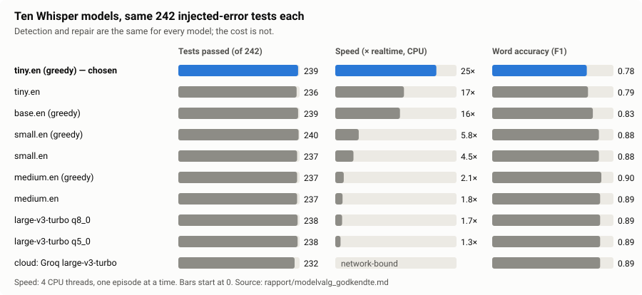
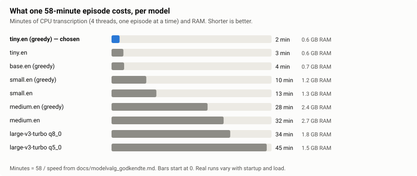
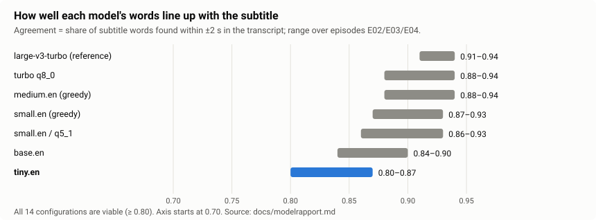
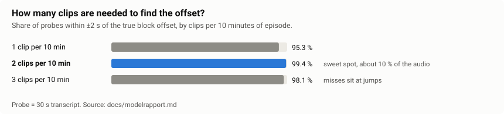
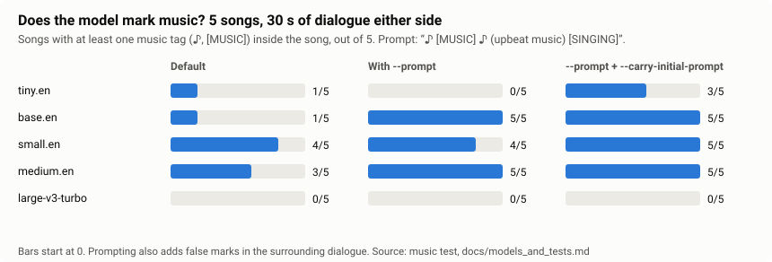

# Models and test sweeps at a glance

What was tested, on what, and what came out. Every number here is copied from a report in this folder or
from a measured run; the report is named under each section. The charts are generated by
[`make_charts.py`](make_charts.py).

**Short version:** every local Whisper model catches and fixes the same errors. The models differ in cost
(time, RAM) and in word accuracy, and the checks do not use word accuracy. So `tiny.en` is the default.

## 1. Which model? Same result, very different cost

Eleven approved episodes (Slow Horses S01E01–E06 and five Known Good episodes), 23 injected-error scenarios,
full and sampled mode, 506 rows per model.

| Model | Sampled (prod) SH / KG | Full SH / KG | Word F1 SH / KG | Speed (× real time) | RAM |
|---|---|---|---|---|---|
| **tiny.en greedy (prod)** | 131/132, 108/110 | 130/132, 108/110 | 0.747 / 0.814 | 25 | 0.6 GB |
| tiny.en | 128/132, 108/110 | 128/132, 108/110 | 0.758 / 0.820 | 17 | 0.6 GB |
| base.en greedy | 131/132, 108/110 | 130/132, 109/110 | 0.811 / 0.857 | 16 | 0.7 GB |
| small.en greedy | 131/132, 109/110 | 130/132, 109/110 | 0.872 / 0.894 | 5.8 | 1.2 GB |
| small.en | 131/132, 106/110 | 130/132, 109/110 | 0.871 / 0.892 | 4.5 | 1.3 GB |
| medium.en greedy | 131/132, 106/110 | 130/132, 108/110 | 0.893 / 0.913 | 2.1 | 2.4 GB |
| medium.en | 130/132, 107/110 | 131/132, 107/110 | 0.886 / 0.902 | 1.8 | 2.7 GB |
| large-v3-turbo q8_0 | 131/132, 107/110 | 130/132, 109/110 | 0.881 / 0.888 | 1.7 | 1.8 GB |
| large-v3-turbo q5_0 | 131/132, 107/110 | 129/132, 109/110 | 0.887 / 0.889 | 1.3 | 1.5 GB |
| cloud Groq large-v3-turbo | 123/132, 109/110 | 124/132, 109/110 | 0.884 / 0.892 | network | – |

- **Detection and fixes: no ranking.** The local models differ by 1–3 rows out of about 240.
- **Word accuracy: tiny is clearly lowest** (F1 0.75–0.81 against 0.87–0.91), but the checks compare
  anchors and timing, so it does not show up in the result.
- **Cloud is not better.** Groq is slightly worse on Slow Horses (123/132): 7 of 9 failures are rate scenarios
  that land 0.254–0.268 s from the 0.25 s bar. It also needs a key and a network.
- All 14 local configurations were tested; the table shows the ones that matter.

Source: [modelvalg_godkendte.md](modelvalg_godkendte.md).

## 2. Do the transcripts line up with the subtitle?

Fifty-two episodes (Community S02/S03, Slow Horses S01) with large-v3-turbo as the reference, then 14 cheaper
configurations on three episodes.

Quantisation costs almost nothing. All 14 configurations are viable (agreement ≥ 0.80).
Source: [modelrapport.md](modelrapport.md).

## 3. How much audio is needed?

Two 30 s clips per 10 minutes find the offset in 99.4 % of probes. A third clip does not help, because
the extra clips more often land on a jump or on silence. The production setup samples clips across the episode and
escalates only when clips disagree.

Source: [modelrapport.md](modelrapport.md).

## 4. What each sweep tested

| Sweep | Scope | Result | Report |
|---|---|---|---|
| Model choice on approved episodes (2026-09-30) | 11 episodes × 23 scenarios × full + sampled, 14 local models + Groq | No ranking between local models; cloud no better | [modelvalg_godkendte.md](modelvalg_godkendte.md) |
| Test matrix | 15 models × 10 episodes × 6 scenarios × 2 modes × 2 audio-confirm, 3600 rows | Sync quality 0.77–0.82 for every model; escalation never fired on a healthy file (0 of 1184 rows) | [testmatrix_konklusion.md](testmatrix_konklusion.md) |
| Agreement with the audio | 52 episodes, large-v3-turbo as reference | tiny 0.80–0.87, medium 0.88–0.94 | [modelrapport.md](modelrapport.md) |
| Detection | 36 healthy and 16 bad files | 16 of 16 bad flagged, 0 of 36 healthy flagged | [modelrapport.md](modelrapport.md) |
| Uneven offsets | 8 healthy episodes, hole / drift / piecewise | Hole 8/8; drift 8/8 flagged ok but loose; piecewise 7/8 good | [modelrapport.md](modelrapport.md) |
| Injected errors, production setup | 11 episodes × 23 scenarios | Every type passes except constant offset 63/66 and per-line jitter 8/11 | [README](../README.md#how-well-it-works) |
| Real library | 100 random episodes from the real library, own stored transcripts | See section 5 | – |
| Full against sampled transcript | 36 of those episodes | See section 5 | – |
| Music marking | 5 songs, 6 models, 3 settings | See section 6 | – |

The test matrix report predates the rate and drift fixes: its finding that drift is not handled applied to the code
of that date and has since been addressed. Treat it as history, not as the current state.

## 5. Real library, and full against sampled transcript

A hundred random episodes from a real library were run through the finished pipeline, and each result was checked against
the app's own stored transcripts.

- It found real gaps, which were fixed: gentle drift and framerate cases the first gates missed, and a steady
  offset of about 2 s.
- It also found three healthy files that a bad alass fit had made worse. A rewrite is now compared with the
  original and undone if it made the file worse. A flag is never changed by the undo.
- False "missing lines" alarms on songs, outros, intros and ads were reduced: the first and last two minutes are
  ignored, and music gets a wide margin.
- **Full against sampled**, 36 episodes: sampled missed no timing error. 31 of 36 flags were the same; of the other
  five, four were false and one was doubtful. Full mode cost about 1.3× the time, so sampled stays the default.

## 6. Can Whisper be told to mark music?

Five songs, with 30 s of dialogue before and after each. Music is detected through the ♪ and `[MUSIC]` tags
Whisper writes. `--prompt` primes the decoder with such tags, and `--carry-initial-prompt` repeats it on every
30 s window instead of only the first.

- **large-v3-turbo does not mark songs** in any setting. It writes them as plain lyrics.
- **base.en, small.en and medium.en mark all five songs with the prompt plus carry**; medium also covers
  about 94 % of each song.
- **The prompt has a price:** more false marks in the dialogue around the songs (5–16 against 0–5 without it),
  although some of those may be real neighbouring music.
- A larger test (eight songs and eight dialogue controls) is running; this section is updated when it is done.
