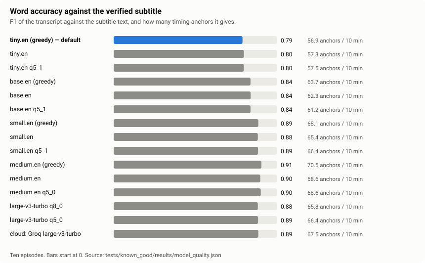

# Models and tests

Every number on this page comes from one reference set: **ten episodes the owner has verified as correct**, run through
the real pipeline with errors injected into the verified subtitle, for 15 Whisper setups and both transcription modes.
That is 10 episodes x 58 error scenarios x 15 models x 2 modes = **17,400 runs**, all completed without a pipeline error.
The data, the runner and the raw results are in [`tests/known_good/`](../tests/known_good/README.md), so anyone can
repeat the measurement. No video or audio is needed. The charts and tables are generated from the results by
[`make_charts.py`](make_charts.py).

Because the subtitle of each episode is known to be right, anything the pipeline changes in an untouched file is a
false positive, and every injected error is known exactly.

## 1. Which model?

<!-- table:models -->
| Model | Errors handled, sampled | Errors handled, full | Healthy files left alone, sampled / full | Speed (x real time) | RAM | Word F1 |
|---|---|---|---|---|---|---|
| **tiny.en (greedy) — default** | 98.0 % (499/509) | 99.0 % (504/509) | 10/10 and 10/10 | 25.5 | 0.6 GB | 0.79 |
| tiny.en | 96.7 % (492/509) | 98.8 % (503/509) | 10/10 and 9/10 | 16.8 | 0.6 GB | 0.80 |
| tiny.en q5_1 | 97.4 % (496/509) | 96.9 % (493/509) | 9/10 and 9/10 | 16.5 | 0.6 GB | 0.80 |
| base.en (greedy) | 96.1 % (489/509) | 97.8 % (498/509) | 9/10 and 8/10 | 16.4 | 0.7 GB | 0.84 |
| base.en | 96.5 % (491/509) | 97.1 % (494/509) | 9/10 and 7/10 | 11.7 | 0.8 GB | 0.84 |
| base.en q5_1 | 97.1 % (494/509) | 97.8 % (498/509) | 9/10 and 9/10 | 11.0 | 0.7 GB | 0.84 |
| small.en (greedy) | 97.1 % (494/509) | 98.6 % (502/509) | 9/10 and 5/10 | 5.8 | 1.2 GB | 0.89 |
| small.en | 97.8 % (498/509) | 99.0 % (504/509) | 9/10 and 5/10 | 4.5 | 1.3 GB | 0.88 |
| small.en q5_1 | 97.1 % (494/509) | 98.2 % (500/509) | 8/10 and 5/10 | 4.6 | 1.1 GB | 0.89 |
| medium.en (greedy) | 97.6 % (497/509) | 98.4 % (501/509) | 10/10 and 8/10 | 2.1 | 2.4 GB | 0.91 |
| medium.en | 97.4 % (496/509) | 98.6 % (502/509) | 8/10 and 6/10 | 1.8 | 2.7 GB | 0.90 |
| medium.en q5_0 | 97.1 % (494/509) | 98.4 % (501/509) | 9/10 and 6/10 | 1.6 | 1.8 GB | 0.90 |
| large-v3-turbo q8_0 | 97.2 % (495/509) | 99.6 % (507/509) | 10/10 and 9/10 | 1.7 | 1.8 GB | 0.88 |
| large-v3-turbo q5_0 | 97.1 % (494/509) | 98.8 % (503/509) | 9/10 and 6/10 | 1.3 | 1.5 GB | 0.89 |
| cloud: Groq large-v3-turbo | 98.0 % (499/509) | 99.2 % (505/509) | 9/10 and 9/10 | network | - | 0.89 |
<!-- /table:models -->

*Errors handled* is the share of all injected-error runs that passed (offsets and rate errors fixed; blocks, holes and swaps
flagged; wrong episode flagged; dropped cues and jitter left alone). *Healthy files left alone* is the control: ten untouched
files, and the file must come out untouched and not flagged.

- **Repair and detection do not separate the models.** Constant offsets are fixed in 49-50 of 50 runs by every model, and
  rate errors (framerate, PAL, drift) in 149-159 of 160. A wrong episode (10/10) and swapped lines (20/20) are caught by all.
- **The false-alarm control does.** The default `tiny.en` (greedy) leaves all ten healthy files alone in both modes. In full
  mode `small.en` leaves only five of the ten alone, `medium.en` and `large-v3-turbo q5_0` six of ten. 48 of the 52 false alarms on healthy
  files in the whole matrix are "part of the episode is out of sync" from the block detector, whose thresholds were
  calibrated on `tiny.en` output; larger models transcribe with different word timing, so a healthy file looks locally off.
- **Word accuracy is lowest for tiny** (F1 0.79-0.80 against 0.84 for base and 0.88-0.91 above), but the checks compare timing anchors, and the matrix shows
  no benefit from the better words.
- **Cloud (Groq) is not better:** 98.0 % handled in sampled mode, one false alarm on the healthy files in each mode, and it needs a key.

`tiny.en` (greedy) transcribes a 58-minute episode in about 2.3 minutes on four CPU threads and needs 0.6 GB; `medium.en` and
`large-v3-turbo` need 28-45 minutes and 1.5-2.7 GB. Speeds are the earlier CPU measurement on five-minute excerpts
([`data/speed/`](../tests/known_good/data/speed/)), reused here.

## 2. What the default model catches

<!-- table:errors -->
| Error type | Passes when | Sampled | Full transcript | Range over all 15 models (sampled) |
|---|---|---|---|---|
| Constant offset (0.7 s to 45 s) | fixed (median error <= 0.25 s, 98 % of lines within 1 s) | 50/50 | 50/50 | 49-50 of 50 |
| Framerate, PAL, drift | fixed, same bar | 159/160 | 159/160 | 152-159 of 160 |
| Blocks at different offsets | flagged (repair is a bonus) | 194/200 | 199/200 | 190-197 of 200 |
| Missing stretch (>= 20 dialogue lines) | flagged and left untouched | 36/39 | 36/39 | 33-38 of 39 |
| Wrong episode | flagged SUSPECT, left untouched | 10/10 | 10/10 | 10 of 10 |
| Swapped lines | flagged for review | 20/20 | 20/20 | 20 of 20 |
| Drift + swapped lines | timing fixed and swaps flagged | 10/10 | 10/10 | 9-10 of 10 |
| Dropped / duplicated cues | left untouched | 10/10 | 10/10 | 10 of 10 |
| Per-line jitter (nothing to fix) | no worse than injected | 10/10 | 10/10 | 10 of 10 |
| Healthy file (no false alarm) | left untouched, not flagged | 10/10 | 10/10 | 8-10 of 10 |
<!-- /table:errors -->

- **Sampled** and **full-transcript** mode agree on offsets, rate errors, wrong episodes, swaps and untouched
  files. The difference is in blocks: sampled flags 194 of 200 block errors, full flags 199 of 200, because short blocks
  can fall between the sampled clips.
  Paired over the three tiny setups (1,740 run pairs), full passes 35 rows that sampled fails and sampled passes 17 that
  full fails: a net gain of about 1 %, almost all of it in blocks (596 against 576 of 600; the 20 missed were not escalated,
  the clips agreed with each other). Repairs are equal (about 23 % of blocks). Sampled mode escalates to the whole
  transcript anyway in 94 % of the block runs, and a whole tiny transcript takes about 2.3 minutes. The setting
  `sync.whisper_mode` is therefore `auto` by default: full transcript with a tiny model, sampled clips with anything bigger,
  where a whole transcript costs 4-10 times more. `sampled` and `full` force one mode.
- **Constant offset of +0.3 s** (just above the 0.25 s decision bar) is reported on its own: 7 of 10 are fixed, the other three stay
  at +0.3 s. It is a boundary, not a miss of a real error.

How much has to be missing before a hole is seen:

<!-- table:bins -->
| Hole removed (dialogue lines) | Detected |
|---|---|
| 0-9 | 16/90 (18 %) |
| 10-19 | 87/240 (36 %) |
| 20-39 | 296/360 (82 %) |
| 40+ | 771/810 (95 %) |

| Start or end cut off | Detected |
|---|---|
| < 150 s | 136/570 (24 %) |
| 150-250 s | 191/330 (58 %) |
| >= 250 s | 242/300 (81 %) |
<!-- /table:bins -->

A hole is found once it removes about 20 dialogue lines; smaller ones carry too little speech to prove anything. Cut-offs at
the start or end are judged less because the first and last two minutes are deliberately not judged (songs, recaps and
promos for other shows made false alarms).

## 3. How far the numbers can be trusted

- **Repeatable.** The matrix replays recorded alass answers and stored Whisper output, so it needs no audio and gives the same
  result on any machine. With a fixed Python hash seed (the runner sets it) a rerun is identical. Without it, the verdict of
  18 of the 17,400 rows (0.10 %, all sampled mode) differs between runs, which points to a step that depends on iteration order.
- **Swapped lines inside cues are not verified in the reference set.** The heuristic flags 22 lines across the ten untouched
  files (1, 4, 0, 4, 1, 1, 1, 5, 1 and 4 per episode), which bounds how many such errors the references can hide.
- **Ten episodes, one language.** The scenarios are a model of real errors, not a sample of them, and thin-dialogue episodes
  give fewer anchors than dense ones. One row is noise; read differences of a few rows as ties.

## 4. Music marking (separate test)

This is a separate, earlier measurement on other material (one sitcom episode with eight songs, and ninety-second dialogue
controls), reused as it was. It asks whether a Whisper model can be told to mark music with `--prompt` and
`--carry-initial-prompt`, which would let the checks ignore songs.

- `large-v3-turbo` does not mark songs in any setting; it writes them as plain lyrics.
- `base.en`, `small.en` and `medium.en` mark all eight songs with the prompt plus the carry flag, and `tiny.en` finds three of five even then.
- The prompt adds false marks in the dialogue: up to 9 across the eight 90-second clips (16 for `tiny.en` with carry), against 2-4 without it. It is therefore not used for whole episodes.
- Result: the checks use no music model. Songs and outros are handled by ignoring the first and last two minutes and a wide
  margin around marked music.

Older reports on earlier episode sets are kept in [`archive/`](archive/) and are not quoted anywhere.
